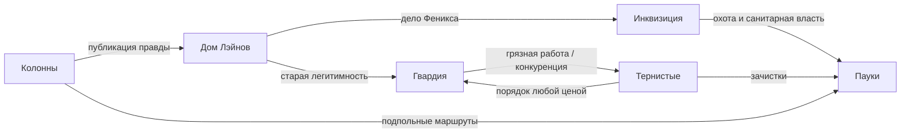

---
tags:
  - thunderage/1-0
  - персонажи
  - отношения
  - карта
  - источник/версия-0-56
---

# Карта отношений — стартовая схема

> Это стартовый граф: центральные узлы, фракционная схема и все отношения, которые удалось вытащить из разделов `## Отношения` в карточках персонажей.

## Центральные узлы

- **Эллиот Лэйн** — протагонист, наследник разрушенного Дома; связан с Жазель, Лэйером, Себастианом и текущим делом «Феникса».
- **Жазель Кюри** — погибшая учёная; связывает Дом Лэйнов, Себастиана, Феликса Гадюку, Инквизицию и проект «Феникс».
- **Норман Эйган** — доносчик/ключевой свидетель операции 1806 года; сюжетный мост к Инквизиции.
- **Зикель Менсер** — стратег Колонн и теневой финансист; связывает Колонны, Йохан Вега, Тьерри Креста и инженерно-сапёрную линию.
- **Юджин Макриди** — навигатор-связист и агент Тернистых; потенциальный предатель безопасной базы.
- **Фридрих Ферр** — новое имя Франца Фердинанда; публичный боевой командир Тернистых.

## Простая схема фракционных связей

## Найденные отношения из карточек (291)

| Кто | С кем | Суть связи |
|---|---|---|
| Виктория Штейн | Курт Эрмак | командир, которого она по-настоящему уважает. Единственный мужчина, который ни разу не усомнился в ней |
| Виктория Штейн | Юджин Макриди | профессиональное уважение, но считает его слишком мягким |
| Виктория Штейн | Конрад Нойман | её заместитель, правая рука, иногда — совесть |
| Виктория Штейн | Рихард Кольц | ветеран из её отряда, которого она спасла — и который теперь пьёт |
| Дункан Варрен | Юджин Макриди | начальник безопасности, который часто ставит невозможные задачи. Дункан выполняет |
| Дункан Варрен | Беньямин Аш | оружейник Тернистых. Они не должны дружить — но оба любят механизмы |
| Дункан Варрен | Ники Лайф | техник, с которым Дункан делит мастерскую и философские беседы о гайках |
| Йохан Вега | Курт Эрмак | старый товарищ. Спорят о тактике, не спорят о ценностях |
| Йохан Вега | Зикель Менсер | любовный интерес. Притяжение между ними строится на уважении, внутренней хрупкости и разнице жизненного опыта. |
| Кейт Картер | Крис Стейман | рабочий союз. Уважает его как хирурга, иногда поправляет его как человека |
| Кейт Картер | Артем Остапов | коллеги с разным прошлым и одинаковым инстинктом |
| Кейт Картер | Эллиот Лэйн | видит в нём потенциал и время от времени говорит ему об этом в форме замечаний |
| Конрад Нойман | Виктория Штейн | командир. Конрад — её тыл, её порядок, её голос разума |
| Конрад Нойман | Альберт Велтен | коллега-логистик. Вместе составляют идеальную пару снабженцев |
| Конрад Нойман | Ники Лайф | неожиданная дружба — Ники чинит то, что Конрад заказывает |
| Крис Стейман | Тэфи Уилсон | близкий друг. Их связь больше похожа на отношения брата и сестры, хотя они не кровные родственники |
| Крис Стейман | Курт Эрмак | наставник. Единственный человек, критику которого Крис принимает без сопротивления |
| Крис Стейман | Эллиот Лэйн | коллега. Первая настоящая дружба в Ордене — для обоих |
| Курт Эрмак | Крис Стейман | ученик и, возможно, преемник. Курт вкладывает в него всё, чего не успел дать другим |
| Курт Эрмак | Эллиот Лэйн | молодой Лэйн нужен Курту — но Курт не говорит зачем |
| Курт Эрмак | Себастиан Кюри | старый товарищ. Один из немногих, кому Курт говорит "я не знаю" |
| Курт Эрмак | Тамара Бонапарт | заместитель. Доверяет её суждению, не всегда соглашается с методами |
| Лизавета Граф | Юджин Макриди | ценит её скорость и надёжность, но Лизавета слишком независима для его вкуса |
| Лизавета Граф | Карло Вено | курьер Пауков. Конкуренция: кто быстрее пересечёт город |
| Лизавета Граф | Тэфи Уилсон | разведчицы. Тэфи работает тихо, Лизавета — быстро. Вместе — идеально |
| Пауло Витте | Дерек Хронт | начальник разведки, единственный, кто может направить хаотичный гений Пауло |
| Пауло Витте | Хан Блэйн | Пауло восхищается его механическими навыками — другой тип гения |
| Пауло Витте | Конрад Нойман | ценит его за организованность — качество, которого Пауло лишён полностью |
| Рихард Кольц | Виктория Штейн | единственный человек, который вытащил его из ямы. Служит ей, как верный пёс |
| Рихард Кольц | Артем Остапов | медик, который лечит его печень и не читает нотаций |
| Рихард Кольц | Франц Фердинанд | два ветерана, два алкоголика — понимают друг друга без слов |
| Тэфи Уилсон | Крис Стейман | близкий друг. Между ними отношения брата и сестры, несмотря на отсутствие кровного родства |
| Тэфи Уилсон | Юджин Макриди | наставник, которому она доверяет |
| Тэфи Уилсон | Эллиот Лэйн | сначала относится настороженно, позже начинает доверять |
| Элиза Монар | Крис Стейман | наставник, защитник. Единственный, кто поверил без оговорок |
| Элиза Монар | Артем Остапов | коллега-медик. Он — полевой, она — хирург. Идеальная связка |
| Элиза Монар | Виктория Штейн | две женщины в мужском мире — молчаливая солидарность |
| Элиза Монар | Себастиан Кюри | учитель анатомии. Его суровость делает её лучше |
| Юджин Макриди | Кристин Глесс | командир и спаситель. Единственный человек, которому Юджин подчиняется добровольно |
| Юджин Макриди | Тэфи Уилсон | доверяет её как снайперу. Профессиональная связь на грани дружбы |
| Юджин Макриди | Дерек Хронт | напряжение. Макриди не верит разведчику — "слишком много знает, слишком мало говорит" |
| Юджин Макриди | Томас Фернон |  |
| Альберт Велтен | Паскаль Велтен | племянник. Любит его, не понимает его выбор, злится и молчит |
| Альберт Велтен | Лэйер Лэйн | работодатель, единственный кому говорит правду в лицо |
| Альберт Велтен | Рой Блэйн | непосредственный подчинённый. "Лучший логист из тех, кто не умер" |
| Диана Арель | Мари Арель | старшая сестра, защитница. Диана обожает и боится её одновременно |
| Диана Арель | Джесси Арель | кузен. Странная дружба — он из Колонн, она из Лэйнов, оба — Арели |
| Диана Арель | Кристин Глесс | подруга. Кристин — логик, Диана — интуиция. Вместе видят всё |
| Диана Арель | Дерек Хронт | заказчик портретов подозреваемых. Ценит её дар выше любого фотографа |
| Жазель Кюри | Лэйер Лэйн | супруг. Их брак начался как фиктивный союз, но со временем развился в нечто более глубокое |
| Жазель Кюри | Эллиот Лэйн | сын. Гордость Жазель, хотя она редко это показывает |
| Жазель Кюри | Себастиан Кюри | отец. Любит его, но разговоры заходят в тупик каждые пять минут |
| Жазель Кюри | Феликс Гадюка | коллега и соперник. Спорят о методах, уважают знания |
| Изабель Аарн | Эллиот Лэйн | бывший подопечный, теперь партнёр. Она вложила в него деньги и время; он дал ей платформу. Отношения сложные — благодарность, уважение, но никогда не будет больше. |
| Изабель Аарн | Жазель Кюри | бывшая коллега. Изабель считает, что Жазель выбрала неправильно, предав науку ради денег Дома Лэйнов. Общаются редко и холодно. |
| Лэйер Лэйн | Жазель Кюри | супруга. Их партнёрство — редкое для его мира подлинное близкое общение |
| Лэйер Лэйн | Эллиот Лэйн | сын. Самая сложная точка его жизни |
| Лэйер Лэйн | Курт Эрмак | деловой партнёр. Взаимное уважение и взаимное недоверие |
| Лэйер Лэйн | Альберт Велтен | давний союзник, единственный, кому позволяет видеть себя уставшим |
| Лэйер Лэйн | Жан Дестенис | инструмент для переговоров, которого ценит за профессионализм |
| Мари Арель | Джесси Арель | сестра. Любовь через расстояние и молчание |
| Мари Арель | Эллиот Лэйн | первый человек в Ордене, которому была рада по-настоящему |
| Мари Арель | Айана Крест | союзницы — Мари лечит тело, Айана лечит разум |
| Маттео Варда | Сесиль Варда | дочь. Гордится ею, но тревожится — её работа переводчика опаснее, чем кажется |
| Маттео Варда | Крис Стейман | коллега-хирург. Маттео считает его блестящим, но слишком рискующим |
| Маттео Варда | Изабель Лэйн | пациент. Маттео — единственный, кто видел Изабель уязвимой |
| Маттео Варда | Рихард Кольц | лечит его от алкоголизма. Пока безуспешно. Не сдаётся |
| Рейнольд Кюри | Себастиан Кюри | отец. Двадцать лет молчания. Теперь — неловкие чаепития |
| Рейнольд Кюри | Жазель Кюри | единокровная сестра. Уважение и осторожность |
| Рейнольд Кюри | Феликс Гадюка | профессиональный контакт — Рейнольд поставляет ингредиенты для антидотов |
| Рейнольд Кюри | Артем Остапов | главный клиент — полевой медик, который регулярно заказывает препараты |
| Себастиан Кюри | Эллиот Лэйн | сводный брат и стратегический оппонент |
| Себастиан Кюри | Дом Лэйнов | одновременно семья, инструмент и политический проект |
| Себастиан Кюри | Ключевые фракции | взаимодействует через расчёт, а не через доверие |
| Тьерри Крест | Изабель Лэйн | партнёр и конкурент. Оба знают, что другой опасен |
| Тьерри Крест | Альберт Велтен | клиент и координатор. Через Альберта идут деньги Ордена |
| Тьерри Крест | Рой Блэйн | должник. Рой задолжал Тьерри — и это влияет на всё |
| Тьерри Крест | Зикель Менсер | конкурент в теневых финансах. Война кошельков |
| Флоранс Дюваль | Изабель Лэйн | госпожа и работодатель. Флоранс знает секреты Дома лучше самой Изабель |
| Флоранс Дюваль | Дерек Хронт | заказчик поддельных документов. Профессиональное уважение |
| Флоранс Дюваль | Лэйер Лэйн | учила его читать. Тайно считает его лучшим из Лэйнов |
| Флоранс Дюваль | Сесиль Варда | коллега-лингвист. Переводят старые тексты вместе |
| Шарль Монтэ | Изабель Лэйн | работодатель, покровитель. Шарль верен ей абсолютно |
| Шарль Монтэ | Мари Арель | тайная симпатия. Оба — аутсайдеры в высшем обществе |
| Шарль Монтэ | Лэйер Лэйн | охраняет его. Считает мягким, но стоящим защиты |
| Шарль Монтэ | Франц Фердинанд | два бойца, противоположные стили — уважение через спарринг |
| Эллиот Лэйн | Лэйер Лэйн | отец. Человек, которого он пытается понять, и чьи ожидания формируют его жизнь |
| Эллиот Лэйн | Жазель Кюри | мать. Её страсть к знаниям вдохновляет его, но они редко говорят об этом |
| Антон Маас | Норман Эйган | начальник, которого Маас уважает за интеллект, но считает слишком мягким |
| Антон Маас | Йамка Шигернальд | партнёр по охоте. Два охотника, один стиль — без лишних слов |
| Антон Маас | Клара Мортис | медиум, которая чувствует демонов раньше Маас. Он ей доверяет — редкость для инквизитора |
| Антон Маас | Борис Темников | создатель "Агонии". Маас — его лучший тестировщик |
| Белла Ридж | Кристин Глесс | коллега-следователь. Кристин работает с мёртвыми уликами, Белла — с живыми |
| Белла Ридж | Дерек Хронт | уважает его методы, но считает слишком осторожным |
| Белла Ридж | Лесси Кикрет | неожиданный друг. Лесси — единственная, с кем Белла может быть нечестной (то есть расслабленной) |
| Белла Ридж | Норман Эйган | начальник. Белла подчиняется, но иногда игнорирует ограничения |
| Густав Пфайль | Крис Стейман | наставник. Густав учился у Стеймана и считает его лучшим хирургом Либерии |
| Густав Пфайль | Элиза Монар | коллега. Два молодых врача, работающих в невозможных условиях |
| Густав Пфайль | Сеймур Квит | Густав лечит тех, кого Квит "обрабатывает". Молчаливая ненависть к ситуации, не к человеку |
| Густав Пфайль | Белла Ридж | профессиональный контакт. Белла допрашивает — Густав проверяет, что допрашиваемый переживёт |
| Дерек Хронт | Ники Лайф | вернул её к жизни, став ключевой фигурой в её судьбе |
| Дерек Хронт | Инквизиция | использует как инструмент для подготовки Судной ночи |
| Дерек Хронт | Главные герои | до раскрытия играет роль ситуативного союзника |
| Жан Дестенис | Лэйер Лэйн | работодатель и единственный, с кем Жан говорит напрямую |
| Жан Дестенис | Дерек Хронт | профессиональная связь. Оба манипулируют — но разными инструментами |
| Жан Дестенис | Эллиот Лэйн | наблюдает с интересом. Видит в нём нечто, что не торопится называть |
| Йамка Шигернальд | Дерек Хронт | начальник. Уважает его профессионализм. Не понимает его как человека |
| Йамка Шигернальд | Эма | единственный человек в Ордене, с которым Йамка говорит о своих землях |
| Йамка Шигернальд | Тэфи Уилсон | молчаливое родство людей, выросших не там, где надо |
| Кристин Глесс | Себастиан Кюри | профессиональные союзники. Спорят о методах, выводы совпадают |
| Кристин Глесс | Дерек Хронт | работает на него — без особой симпатии, но с профессиональным уважением |
| Кристин Глесс | Норман Эйган | знает его историю. Не осуждает, но держит дистанцию |
| Лесси Кикрет | Дерек Хронт | начальник. Доверяет ему профессионально — и только профессионально |
| Лесси Кикрет | Эллиот Лэйн | интересен тем, что видит её, а не роль. Это пугает |
| Лесси Кикрет | Норман Эйган | коллега. Понимает её лучше, чем ей хотелось бы |
| Нанна Вирт | Ореол Трах | наставник, защитник. Ореол следит, чтобы книги не "заразили" Нанну |
| Нанна Вирт | Флоранс Дюваль | коллега-архивист. Две женщины, живущие среди бумаг — понимают друг друга |
| Нанна Вирт | Жан Дестенис | Нанна помогает расшифровывать демонические тексты для его исследований |
| Нанна Вирт | Дерек Хронт | использует её знания для разведки — Нанна не всегда знает, для чего |
| Норман Эйган | Дерек Хронт | начальник. Норман его уважает и немного боится — они слишком похожи |
| Норман Эйган | Паскаль Велтен | коллега по фракции. Норман видит в нём то, чем сам был — и пытается предупредить |
| Норман Эйган | Эллиот Лэйн | видит в нём честность. Редкое ощущение |
| Ореол Трах | Антон Маас | ученик. Ореол учил его охоте; теперь Маас превзошёл учителя в бою, но не в мудрости |
| Ореол Трах | Клара Мортис | медиум, которую Ореол считает даром, а не проклятием |
| Ореол Трах | Отто Зурц | молодой капеллан, напоминающий Ореолу его самого — сорок лет назад |
| Ореол Трах | Курт Эрмак | старые друзья. Ореол крестил Ордень Ланцета (неофициально) |
| Паскаль Велтен | Альберт Велтен | дядя. Любит его, стыдится, что редко говорит об этом |
| Паскаль Велтен | Норман Эйган | коллега по фракции. Норман видит в нём своё молодое "я" — Паскаль этого не знает |
| Паскаль Велтен | Эллиот Лэйн | через псионику "История" у них неожиданная связь — оба видят прошлое |
| Сеймур Квит | Нанна Вирт | поставщик книг. Странная дружба гиганта и библиотекаря |
| Сеймур Квит | Антон Маас | коллега по "тёмной работе". Уважение без теплоты |
| Сеймур Квит | Норман Эйган | начальник, чьи приказы Сеймур выполняет без вопросов — почти |
| Сеймур Квит | Рихард Кольц | два человека, которых война научила убивать. Молча пьют чай/водку |
| Хильда Бронс | Антон Маас | старший охотник. Хильда уважает его опыт, но считает, что он слишком привязан к городу |
| Хильда Бронс | Томас Кукушка | два снайпера, разные территории — Томас в городе, Хильда за стеной. Обмениваются опытом |
| Хильда Бронс | Лизавета Граф | обе — женщины, которые предпочитают животных людям. Молчаливое понимание |
| Хильда Бронс | Йамка Шигернальд | партнёр по вылазкам за стену. Хильда следит, Йамка бьёт |
| Агнесса Плиц | Флоранс Дюваль | коллега-архивист. Агнесса хранит факты, Флоранс — создаёт их. Настороженное уважение |
| Агнесса Плиц | Тамара Бонапарт | старые подруги. Единственный человек, с которым Агнесса пьёт чай по воскресеньям |
| Агнесса Плиц | Ева Соберано | инспектор, которой Агнесса предоставляет данные для аудита |
| Агнесса Плиц | Дерек Хронт | использует её данные для разведки — Агнесса знает, но делает вид, что не знает |
| Джесси Арель | Эллиот Лэйн | любовный интерес. Между ними постепенно формируется доверие, которое перерастает в чувство |
| Джесси Арель | Мари Арель | сестра. Любовь через расстояние, вину и молчание |
| Джесси Арель | Дерек Хронт | начальник. Уважает за профессионализм, не задаёт лишних вопросов |
| Джесси Арель | Тэфи Уилсон | сходство судеб. Не дружат, но понимают друг друга без слов |
| Ева Соберано | Альберт Велтен | Ева проверяет его бухгалтерию. Велтен нервничает — есть от чего |
| Ева Соберано | Рой Блэйн | Ева расследует его связи с Пауками. Пока — недостаточно доказательств |
| Ева Соберано | Конрад Нойман | уважает его порядок. Единственный военный, чьи ведомости без ошибок |
| Ева Соберано | Тамара Бонапарт | союзница в борьбе с коррупцией. Редкий случай профессионального доверия |
| Зикель Менсер | Мари Арель | может быть его выбором, если игрок поведёт сюжет в эту сторону — её мягкость контрастирует с его внутренними сомнениями |
| Зикель Менсер | Йохан Вега | альтернативный любовный интерес, полная противоположность Мари — её сила и независимость привлекают его |
| Зикель Менсер | Тернистые | фракция, влияние которой он должен расширить в рамках тайной миссии |
| Иза Трал | Крис Стейман | рабочая пара. Доверяет ему полностью в операционной |
| Иза Трал | Жазель Кюри | обменивается знаниями о препаратах. Тихое взаимоуважение |
| Иза Трал | Айана Крест | понимают друг друга без слов — обе работают с тем, что нельзя увидеть |
| Макс Реккер | Тамара Бонапарт | прокурор. Профессиональное соперничество и тайное уважение |
| Макс Реккер | Белла Ридж | следователь, чьи улики Реккер оценивает в суде |
| Макс Реккер | Тьерри Крест | банкир, которого Реккер мечтает посадить, но не может — недостаточно доказательств |
| Макс Реккер | Изабель Лэйн | политический противник. Изабель управляет за кулисами; Реккер — по закону |
| Матиас Трал | Иза Трал | родственница. Матиас — в поле, Иза — в кабинете. Иногда ссорятся о методах |
| Матиас Трал | Карло Вено | курьер Пауков. Матиас знает, что Карло возит контрабанду. Карло знает, что Матиас знает. Игра в кошки-мышки |
| Матиас Трал | Аликс Нерман | Матиас подозревает его в контрабандных схемах, но не может доказать |
| Матиас Трал | Конрад Нойман | обмен данными о поставках — военная логистика и таможня пересекаются |
| Ники Лайф | Сэм Риггет | напарница, которую Ники пытается удержать от саморазрушительной мести |
| Ники Лайф | Дерек Хронт | связан с её воскрешением и источником способности |
| Ники Лайф | Кредиторы и старые знакомые | постоянный источник давления и сюжетных конфликтов |
| Отто Блэйн | Рой Блэйн | брат. Восемь лет молчания. Отто знает о его коррупции — и молчит |
| Отто Блэйн | Хан Блэйн | племянник. Единственная связь с братом — через механика-племянника |
| Отто Блэйн | Дункан Варрен | инженеры-единомышленники. Отто строит — Дункан взрывает. Взаимопонимание |
| Отто Блэйн | Ники Лайф | техник, который чинит то, что Отто проектирует |
| Ренато Кастро | Карло Вено | конкурент. Почта vs. курьеры Пауков — борьба за скорость доставки |
| Ренато Кастро | Пауло Витте | шифровальщик, через которого проходят закодированные письма Ордена |
| Ренато Кастро | Конрад Нойман | логистика почты и логистика армии — пересекаются на складах |
| Ренато Кастро | Альберт Велтен | Ренато передаёт финансовые документы Ордена через почту — в обычных конвертах |
| Рой Блэйн | Хан Блэйн | брат. Младший, которого нужно беречь |
| Рой Блэйн | Альберт Велтен | начальник. "Ворчит, но знает дело — работать можно" |
| Рой Блэйн | Джерри Сорока | коллега по добыче материалов. Разные методы, общий результат |
| Тамара Бонапарт | Курт Эрмак | командир. Уважает. Иногда поправляет. Он принимает это |
| Тамара Бонапарт | Альберт Велтен | союзник по логистике. Ворчат друг на друга, доверяют друг другу |
| Тамара Бонапарт | Франц Фердинанд | конфликт. Видит в нём хаос, которому дали оружие |
| Фиона Колумб | Ева Соберано | союзница. Обе борются с коррупцией — Ева изнутри, Фиона снаружи |
| Фиона Колумб | Рой Блэйн | враг. Фиона расследует его деятельность. Рой пытается заткнуть газету |
| Фиона Колумб | Лесси Кикрет | информатор. Лесси делится новостями из Инквизиции |
| Фиона Колумб | Изабель Лэйн | сложные отношения. Изабель иногда сливает информацию — когда ей выгодно |
| Хан Блэйн | Рой Блэйн | брат. Всё, что нужно знать |
| Хан Блэйн | Юджин Макриди | коллеги. Уважают друг друга через профессию |
| Хан Блэйн | Эллиот Лэйн | Хан редко говорит с ним, но всегда замечает, что с ним происходит |
| Айана Крест | Мари Арель | союзницы. Мари — тело, Айана — разум. Работают в паре при сложных случаях |
| Айана Крест | Иза Трал | понимают друг друга — обе работают с тем, что нельзя увидеть |
| Айана Крест | Норман Эйган | предложила ему помощь. Он отказался. Она не настаивает, но ждёт |
| Беньямин Аш | Зикель Менсер | союз мастеров. Зик — механика, Беньямин — оружие |
| Беньямин Аш | Руби Панцерфауст | она их использует, он обслуживает. Взаимопонимание специалистов |
| Беньямин Аш | Юджин Макриди | работают вместе по боевому снаряжению |
| Карло Вено | Сэм Риггет | друг детства. Единственный человек, которому говорит правду без фильтров |
| Карло Вено | Джерри Сорока | работает на него для доставок. Деловое уважение |
| Карло Вено | Эллиот Лэйн | один из немногих в Ордене, кто не смотрит на него как на мальчика на побегушках |
| Морис Бэль | Рой Блэйн | тот, кто привёл его сюда. Благодарность через хорошую еду каждый день |
| Морис Бэль | Альберт Велтен | коллеги по снабжению. Ворчат вместе |
| Морис Бэль | Айана Крест | союзники. Морис кормит тело, Айана — разум. Понимают важность друг друга |
| Отто Зурц | Клара Мортис | неожиданное взаимопонимание двух людей, которые работают со смертью с разных сторон |
| Отто Зурц | Себастиан Кюри | говорят о смерти иначе, но понимают друг друга |
| Отто Зурц | Норман Эйган | Норман иногда заходит к нему вечером. Они пьют чай и молчат. Это помогает |
| Сесиль Варда | Жан Дестенис | партнёр по переговорам. Дополняют друг друга идеально |
| Сесиль Варда | Йамка Шигернальд | переводит для неё — и учится у неё языку мест, где нет слов |
| Сесиль Варда | Паскаль Велтен | коллеги через тексты. Он изучает историю, она — языки истории |
| Аликс Нерман | Зикель Менсер | партнёр. Зик — механика, Аликс — электроника. Вместе непобедимы |
| Аликс Нерман | Лилия Нерман | приёмная дочь. Эта связь — святое для Аликса, его главная мотивация защищать город |
| Аликс Нерман | Виктор Романов | уважает как профессионала, иногда не понимает его сложность |
| Аликс Нерман | Эллиот Лэйн | объясняет ему технические вещи. Единственный, кто его слушает до конца |
| Анна Сорока | Джерри Сорока | муж. Любит его, несмотря на всё. Он — мускулы, она — мозги |
| Анна Сорока | Лилия Нерман | "племянница" (не по крови). Анна подкармливала Лилию после смерти матери |
| Анна Сорока | Рейнольд Кюри | тайный поставщик лекарств. Рейнольд продаёт через Анну дешёвые медикаменты для Паутины |
| Анна Сорока | Матиас Трал | вечный противник. Таможня vs. чёрный рынок — война, в которой никто не побеждает |
| Виктор Романов | Дерек Хронт | коллега и соперник. Оба знают, что у другого есть своя игра |
| Виктор Романов | Аликс Нерман | работает с ней на технической стороне. Удивлён её возрастом и способностями |
| Виктор Романов | Эллиот Лэйн | видит в нём что-то искреннее. Это для Романова почти как аномалия |
| Гарри Криспи | Дерек Хронт | работодатель. Хронт ценит его профессионализм, Гарри — его деньги |
| Гарри Криспи | Ники Лайф | два механика — один чинит, другой ломает. Обмениваются знаниями |
| Гарри Криспи | Карло Вено | напарник по "тихим" делам. Карло доставляет, Гарри вскрывает |
| Гарри Криспи | Хан Блэйн | Гарри учил Хана основам механики. Хан применил их... по-своему |
| Джерри Сорока | Рой Блэйн | коллеги по снабжению. Разные методы, общий результат |
| Джерри Сорока | Аликс Нерман | снабжает её техническими компонентами. Она — его лучший заказчик |
| Джерри Сорока | Карло Вено | работает с ним на доставке. Доверяет ему за скорость |
| Зоя Вано | Лилия Нерман | лучшая подруга. Единственный человек, перед которым Зоя снимает маску |
| Зоя Вано | Дерек Хронт | работодатель. Зоя уважает его ум — но никогда не сядет с ним играть |
| Зоя Вано | Тьерри Крест | постоянный партнёр за карточным столом. Оба мошенничают — оба знают |
| Зоя Вано | Ибрагим аль-Рустам | телохранитель, которого Зоя наняла через Пауков. Он — единственный, кому она доверяет спину |
| Ибрагим аль-Рустам | Зоя Вано | нанимательница и подопечная. Ибрагим охраняет её — и видит в ней дочь, которой у него нет |
| Ибрагим аль-Рустам | Аликс Нерман | работодатель. Деловые отношения, без тепла, без вражды |
| Ибрагим аль-Рустам | Юджин Макриди | два солдата из разных армий. Уважение через молчаливое понимание |
| Ибрагим аль-Рустам | Курт Эрмак | Ибрагим видит в нём офицера, за которого стоит умереть |
| Кирро Хикс | Дерек Хронт | единственный, с кем разговаривает по работе |
| Кирро Хикс | Юджин Макриди | взаимное профессиональное признание. Не дружба — что-то ближе к уважению |
| Кирро Хикс | Тэфи Уилсон | понимают друг друга без слов. Два человека, которые работают тихо |
| Лилия Нерман | Аликс Нерман | отец. Любит его, ненавидит его мир. Не может уйти — не может остаться |
| Лилия Нерман | Паук | покровитель? Манипулятор? Лилия не уверена. Но он — единственный, кроме отца, кто воспринимает её всерьёз |
| Лилия Нерман | Зоя Вано | подруга, напарница, единственный человек, которому Лилия доверяет полностью |
| Лилия Нерман | Руби Панцерфауст | из Тернистых. Две молодые женщины, два разных бунта — тайная дружба через границу фракций |
| Паук | Аликс Нерман | правая рука. Единственный, кто знает Паука в лицо (кроме Лилии) |
| Паук | Лилия Нерман | дочь Аликса, "наследница". Паук присматривает за ней — не из доброты, из инвестиции |
| Паук | Курт Эрмак | Паук уважает Эрмака — единственный идеалист, который не раздражает. Полезный идеалист |
| Паук | Тьерри Крест | деловой партнёр. Банкир отмывает деньги Паука, Паук позволяет банкиру жить |
| Сэм Риггет | Ники Лайф | союзница и эмоциональный противовес в сюжете |
| Сэм Риггет | Аликс | личный враг, связанный с ключевой травмой Сэм |
| Сэм Риггет | Пауки | семья, за которую она готова драться до конца |
| Эма | Йамка Шигернальд | единственная, с кем разговаривает как с равной |
| Эма | Курт Эрмак | взаимное признание того, что никто не говорит вслух |
| Эма | Клара Мортис | связаны через область, которую обе понимают и о которой не спорят |
| Эма | Эллиот Лэйн | видит в нём что-то. Когда скажет что именно — это изменит всё |
| Артем Остапов | Кейт Картер | профессиональное уважение. Разные школы, одна цель |
| Артем Остапов | Феликс Гадюка | рабочий тандем. Феликс делает яды и противоядия, Артем применяет |
| Артем Остапов | Томас Кукушка | пара на вылазках. Томас прикрывает, Артем лечит |
| Волк | Руби Панцерфауст | заместитель. Волк доверяет ей боевые операции |
| Волк | Франц Фердинанд | старый товарищ, разведчик. Два ветерана одного дела |
| Волк | Курт Эрмак | уважение и настороженность. Оба хотят помочь — разными методами |
| Волк | Паук | враг? Партнёр? Оба управляют Паутиной/Шрамами. Территориальное напряжение |
| Клара Мортис | Эма | родство через знание того, о чём другие предпочитают не говорить |
| Клара Мортис | Себастиан Кюри | неожиданное взаимопонимание. Оба работают с мёртвыми — с разных сторон |
| Клара Мортис | Феликс Гадюка | понимают друг друга через работу с запретным |
| Лина Моор | Нанна Вирт | поставщик книг. Две женщины, объединённые верой в знание — по разные стороны стены |
| Лина Моор | Волк | Лина учит его людей. Волк защищает её школу. Молчаливое партнёрство |
| Лина Моор | Ромул Остапов | бывший ученик. Лина учила его грамоте — он превратил грамоту в оружие |
| Лина Моор | Руби Панцерфауст | Лина учила Руби читать. Теперь Руби защищает школу от рейдов |
| Маркус Ферр | Беньямин Аш | коллега-оружейник. Два мастера — Маркус куёт, Беньямин настраивает |
| Маркус Ферр | Волк | Маркус вооружает его людей. Верит в его дело — молча |
| Маркус Ферр | Дункан Варрен | два инженера из разных миров. Если бы не фракции — были бы друзьями |
| Маркус Ферр | Конрад Нойман | Маркус тайно поставляет ремонтные материалы через Ордень — Конрад закрывает глаза |
| Нина Панцерфауст | Руби Панцерфауст | младшая сестра. Нина боится за неё каждый день |
| Нина Панцерфауст | Крис Стейман | наставник на расстоянии. Снабжает лекарствами, консультирует |
| Нина Панцерфауст | Артем Остапов | коллега-полевик. Два медика, одна война — по разные стороны |
| Нина Панцерфауст | Элиза Монар | коллега. Обе — женщины-врачи в мире, который не хочет их видеть |
| Рита Кукушка | Томас Кукушка | старший брат. Научил стрелять, не научил останавливаться. Рита прощает |
| Рита Кукушка | Волк | командир. Рита — его глаза на крышах Шрамов |
| Рита Кукушка | Хильда Бронс | два снайпера — Хильда в лесу, Рита в городе. Мечтают обменяться территориями |
| Рита Кукушка | Лилия Нерман | подруга. Лилия бегает по улицам, Рита наблюдает сверху. Взаимное прикрытие |
| Ромул Остапов | Артем Остапов | старший брат. Любовь и идеологический раскол. Ромул считает его коллаборантом; Артем — Ромула безответственным |
| Ромул Остапов | Волк | идеологический лидер. Ромул пишет его речи — или Волк говорит то, что Ромул думает? |
| Ромул Остапов | Фиона Колумб | журналистка Колонн. Ромул уважает её за честность, но считает, что "честная пресса" — оксюморон |
| Ромул Остапов | Клара Мортис | Ромул восхищается её мистическим даром и боится его одновременно |
| Руби Панцерфауст | Франц Фердинанд | командир и идеолог. Руби следует за идеей, не за человеком |
| Руби Панцерфауст | Беньямин Аш | коллеги. Он чинит оружие, она его использует |
| Руби Панцерфауст | Зикель Менсер | неожиданно хорошо понимают друг друга — оба работают с тем, что можно взорвать или построить |
| Томас Кукушка | Тэфи Уилсон | профессиональный союз без лишних слов |
| Томас Кукушка | Артем Остапов | работают в паре на вылазках — Томас прикрывает, Артем лечит |
| Томас Кукушка | Франц Фердинанд | слушает командира, когда тот не увлекается речами |
| Феликс Гадюка | Жазель Кюри | соперничество и уважение. Разные этические рамки, общий предмет |
| Феликс Гадюка | Клара Мортис | неожиданное родство — оба работают с тем, что большинство считает запретным |
| Феликс Гадюка | Артем Остапов | полевая связь. Феликс создаёт антидоты, Артем их применяет |
| Франц Фердинанд | Йохан Вега | постоянный конфликт. Оба правы. Оба нужны |
| Франц Фердинанд | Руби Панцерфауст | слушает его — не потому что командир, а потому что верит |
| Франц Фердинанд | Курт Эрмак | уважение через разногласие. Франц считает Курта реалистом без огня. Курт считает Франца огнём без направления |

## Решения для перекрёстных упоминаний

- Если персонаж А упоминает персонажа Б как значимую связь, у Б должно быть ответное упоминание или причина отсутствия связи.
- Для 1.0 приоритетно проверить пары: Жазель—Феликс, Зикель—Йохан, Юджин—Томас/Тернистые, Тэфи—Лизавета, Маттео—Крис, Тьерри—Зикель.
- Отношения с «Францем Фердинандом» при переносе считать отношениями с **Фридрихом Ферром**.