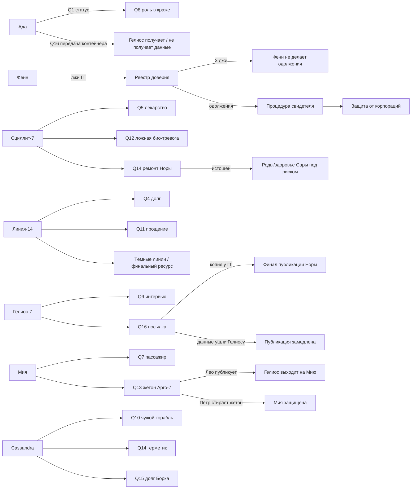

# EXODUS — большая сжатая блок-схема квестов v2

Основа: документ `exodus_quests_v2.docx`.

## Легенда

- `Q` — квест.
- `A/B/C` — основные цепочки.
- `S` — секретное ответвление.
- `+` — бонус/открытие.
- `-` — штраф/потеря доверия/риск.
- `→ Qx` — связь с другим квестом.

---

## 1. Глобальная карта зависимостей

```mermaid
flowchart TD
    START([Станция ГГ / РУБИ / серый сектор]) --> Q1[Q1 Показания\nФенн · Ада]
    START --> Q2[Q2 Топливо\nЧейз · Дейн · Эли]
    START --> Q3[Q3 Сигнал\nЗита · Нора · Фенн]
    START --> Q4[Q4 Долг\nПётр · Сара · Дейн]
    START --> Q5[Q5 Лекарство\nСара · Эли · Нора]

    Q1 -->|Статус Ады| Q8[Q8 Ночная смена\nЭли · Ада · Пётр]
    Q1 -->|Фенн / сын / группа с семёркой| FENNARC[Арка Фенна\n22-летнее расследование]

    Q2 -->|Маяк Гелиоса установлен| Q10[Q10 Чужой корабль\nДейн · Фенн · Виктор]
    Q2 -->|Анонимный заказчик = Гелиос| HELIOS[Корпоративная арка\nГелиос-Инфо / Гелиос-7]
    Q2 -->|Доверие Чейза / скидки| CHASEARC[Арка Чейза]

    Q3 -->|Подмена/утечка координат| NORAARC[Арка Норы\nсклад данных / публикация]
    Q3 -->|Ложь Фенну| FENNREP[Реестр Фенна\nлжи и одолжения]
    Q3 -->|Успешная подмена| Q9[Q9 Интервью\nЛео · Нора · Чейз]

    Q4 -->|Линия-14 / 7 погибших| Q11[Q11 Прощение\nПётр · Чейз]
    Q4 -->|Маршрут Тёмных линий| DARKLINES[Тёмные линии\nфинальный ресурс]
    Q4 -->|Доверие Сары| SARAARC[Арка Сары и Дейна]

    Q5 -->|Сциллит-7 / препарат| Q12[Q12 Карантин\nФенн · Сара · Эли · РУБИ]
    Q5 -->|Резерв Сциллита-7| Q14[Q14 Протечка\nЧейз · Эли · Нора]
    Q5 -->|Этика Эли| ELIARC[Арка Эли]

    Q6[Q6 Запись\nЧейз · Лео · Дейн · Фенн] -->|Доказательство по контейнерам| Q10
    Q6 -->|Процедура свидетеля| FENNREP
    Q6 -->|Канал Лео принадлежит Гелиосу| HELIOS

    Q7[Q7 Пассажир\nЗита · Фенн · Мия] -->|Мия остаётся / уезжает| Q13[Q13 Последний билет\nЗита · Лео · Пётр]
    Q7 -->|Мия как помощник по реестрам| MIAARC[Арка Мии / Реестр Исхода]

    Q8 -->|Реагент / заказчик Гелиос| HELIOS
    Q8 -->|Ада под риском устранения| ADAARC[Арка Ады]
    Q8 -->|Ошибка Эли с ключом| ELIARC

    Q9 -->|Фрагмент Гелиос-7| Q16[Q16 Посылка\nМия · Эли · Ада]
    Q9 -->|Лео + Нора: публикация| NORAARC
    Q9 -->|Чейз и Лео прошлый конфликт| CHASEARC

    Q10 -->|Война корпораций / Кассандра| CASS[Cassandra]
    Q10 -->|Дейн советуется с Сарой| SARAARC
    Q10 -->|Груз Гелиоса| HELIOS

    Q11 -->|Лучшая сцена Чейз-Дейн| SARAARC
    Q11 -->|Имя Кая| CHASEARC

    Q12 -->|Сару забирают в центр Гелиоса| HELIOS
    Q12 -->|Эли спрашивает «для чего»| ELIARC
    Q12 -->|Квест родов может закрыться| SARAARC

    Q13 -->|Жетон отца Мии / Арго-7| MIAARC
    Q13 -->|Пётр связан с пилотом Арго-7| DARKLINES
    Q13 -->|Гелиос может купить жетон| HELIOS

    Q14 -->|Кассандра получает услугу| CASS
    Q14 -->|Гелиос видит поставку катализатора| HELIOS
    Q14 -->|Сциллит-7 истощён| SARAARC

    Q15[Q15 Сосед\nВиктор · Зита · Фенн] -->|Сеть малых станций| SMALLSTATIONS[Сеть малых станций]
    Q15 -->|Долг Борка / контроль Гелиоса| HELIOS
    Q15 -->|Одолжение Фенна| FENNREP
    Q15 -->|Кассандра может выкупить долг| CASS

    Q16 -->|Копия Гелиос-7| NORAARC
    Q16 -->|Передача через Аду замедляет публикацию| HELIOS
    Q16 -->|Муляж сохраняет источник| LEAKSRC[Живой источник утечек]

    HELIOS --> FINAL[Финальная конфигурация сектора]
    CASS --> FINAL
    NORAARC --> FINAL
    FENNREP --> FINAL
    SARAARC --> FINAL
    MIAARC --> FINAL
    SMALLSTATIONS --> FINAL
```

---

## 2. Сжатая блок-схема всех квестов

```mermaid
flowchart TD

%% ================= Q1 =================
Q1([Q1 Показания\nФенн требует подпись против Ады]) --> Q1A{A: поговорить с Адой}
Q1 --> Q1B{B: ответить Фенну сразу}
Q1A --> Q1A1[Сдать Аду]
Q1A1 --> Q1A1T[Если Ада права: вор уходит\n+ компенсация\n- серые клиенты 10%]
Q1A1 --> Q1A1F[Если Ада лжёт: вор пойман\nАда ворует герметик\n→ Q14]
Q1A --> Q1S[S: камеры дока + тех 2\nАда не трогала панель\nсилуэт с тату 7]
Q1S --> Q1SS[Фенн запускает личное расследование\n→ арка сына Фенна]
Q1B --> Q1B1[Подтвердить присутствие Ады\nНора теряет источник]
Q1B --> Q1B2[Отказаться от запроса\n- Фенн помечает ГГ]
Q1 --> Q1LINK[Статус Ады → Q8]

%% ================= Q2 =================
Q2([Q2 Топливо\nЧейзу нужен Т-7 за 4 дня]) --> Q2A{A: помочь с компонентами}
Q2 --> Q2B{B: выяснить детали}
Q2A --> Q2A1[Уговорить Дейна\nинфо: заказчик платил x2]
Q2A1 --> Q2NORA[Передать Норе\nНора узнаёт Гелиос\nЧейз остаётся без топлива]
Q2A --> Q2A2[Заплатить Дейну\nмаяк сорван\n+ имя посредника]
Q2B --> Q2B1[Узнать правду Чейза\nлекарства матери друга]
Q2B1 --> Q2HELP[Помочь зная правду\n+ жетон долга Чейза]
Q2B1 --> Q2NO[Отказать зная правду\nмать друга умирает]
Q2 --> Q2S[S: предупредить Эли\nон отказывает Гелиосу\n- клиенты Эли\n+ этика Эли]
Q2 --> Q2LINK[Если маяк установлен → Q10 быстрее]

%% ================= Q3 =================
Q3([Q3 Сигнал\nЗита хочет отправить сигнал с лицензии станции]) --> Q3A{A: позволить передачу}
Q3 --> Q3B{B: заблокировать}
Q3A --> Q3A1[Разрешить и не предупредить Фенна\nГелиос получает координаты склада\nНора закрывается на 6 дней]
Q3A --> Q3A2[Сказать Зите о предателе\nпередача отменена\nНора раскрывает ложный след]
Q3B --> Q3B1[Назвать Фенну Зиту\nпроверка, отлёт задержан 5 дней]
Q3B --> Q3B2[Ввести Фенна в заблуждение\nсигнал уходит\n+ ложь Фенну]
Q3 --> Q3S[S: тех 3 + координаты Норы\nподмена пакета\nГелиос получает ложные координаты]
Q3S --> Q3LINK[+ доверие Норы\n→ Q9 глубокий вариант]

%% ================= Q4 =================
Q4([Q4 Долг\nПётр требует долг Дейна]) --> Q4A{A: понять суть}
Q4 --> Q4B{B: не вмешиваться}
Q4A --> Q4A1[Говорить с обоими\nЛиния-14 / 7 погибших]
Q4A1 --> Q4DAIN[Сказать Дейну\nон идёт к Петру сам]
Q4A1 --> Q4PETR[Сказать Петру\nоткрытый разговор]
Q4A --> Q4A2[Оплатить долг самому\nПётр возвращает деньги\n- Сара]
Q4A2 --> Q4SARA[Сара раскрывает правду]
Q4B --> Q4B1[Отказать Петру\nПётр давит через груз Дейна]
Q4 --> Q4S[S: архив 3 года + соц 3\nдоказательство: коммуникатор Дейна]
Q4S --> Q4S1[Передать Петру\nюридический рычаг]
Q4S --> Q4S2[Уничтожить\nриск инспекции Фенна]
Q4S --> Q4S3[Передать Дейну\nнастоящий долг перед ГГ]
Q4 --> Q4LINK[Линия-14 → Q11\nТёмные линии → финал]

%% ================= Q5 =================
Q5([Q5 Лекарство\nотклонение в препарате Сары]) --> Q5A{A: к Эли первым}
Q5 --> Q5B{B: к Норе первой}
Q5A --> Q5A1[Показать анализ без контекста\nЭли узнаёт почерк Норы]
Q5A --> Q5A2[Рассказать всё\nЭли идёт к Норе\nвопрос: доверять ли Норе]
Q5B --> Q5B1[Предъявить Норе\nона признаёт эксперимент]
Q5B --> Q5B2[Сказать Саре про Нору\nСара принимает как неуклюжую заботу]
Q5 --> Q5S[S: независимая проверка\nстабилизатор безопасен\nно эксперименты Норы скрыты]
Q5S --> Q5S2[Мед 3: прошлое Сары\nпотерянная беременность]
Q5 --> Q5LINK[Сциллит-7 → Q12/Q14]

%% ================= Q6 =================
Q6([Q6 Запись\nЛео приносит флэшку]) --> Q6A{A: слушать}
Q6 --> Q6B{B: не слушать}
Q6A --> Q6A1[Слушать с Лео\nразрешить публикацию = Гелиос получает копию]
Q6A --> Q6A2[Слушать одному\nЛео ведёт своё расследование]
Q6B --> Q6B1[Уничтожить при Лео\nматериал: ГГ предпочёл не знать]
Q6B --> Q6B2[Отдать Чейзу закрытой\nЧейз сам раскрывает содержание]
Q6 --> Q6S[S: скопировать флэшку\nдоказательство по контейнерам]
Q6S --> Q6FENN[Передать Фенну\nправовое поле + обвинение]
Q6S --> Q6LEVER[Использовать как рычаг]
Q6S --> Q6DESTROY[Уничтожить копию\nложь Фенну]
Q6 --> Q6LINK[Процедура свидетеля / Q10]

%% ================= Q7 =================
Q7([Q7 Пассажир\nМия живёт у Зиты в отсеке]) --> Q7A{A: скрыть Мию}
Q7 --> Q7B{B: сообщить Фенну}
Q7A --> Q7A1[Спрятать в техотсеке\nМия сама идёт к Фенну]
Q7A --> Q7A2[Зита говорит Мие про Арго-7\nМия просит искать человека]
Q7B --> Q7B1[Предупредить Фенна\nстандартный протокол\nМия уезжает]
Q7 --> Q7S[S: Реестр Исхода\nГГ сам находит Арго-7]
Q7S --> Q7MIA[Мия остаётся\n+ поиск в закрытых базах]
Q7 --> Q7LINK[Мия / Арго-7 → Q13]

%% ================= Q8 =================
Q8([Q8 Ночная смена\nиз лаборатории Эли украден реагент]) --> Q8A{A: расследовать}
Q8 --> Q8B{B: обвинить без расследования}
Q8A --> Q8A1[Допросить Аду\nона признаётся\nреагент у посредника]
Q8A1 --> Q8RISK[Вернуть реагент\nАда засвечена перед Гелиосом]
Q8A --> Q8A2[Допросить Петра\nон видел Аду\nобмен: заказчик за инфо Q1]
Q8B --> Q8B1[Публично обвинить Аду\nсинтез хуже на 30%]
Q8 --> Q8S[S: ключ был скопирован\nсписок: Ада/Пётр/Нора/Чейз]
Q8S --> Q8ELI[Эли признаёт ошибку]
Q8 --> Q8LINK[Если Ады нет из Q1 — роль у другого посредника]

%% ================= Q9 =================
Q9([Q9 Интервью\nЛео хочет 20 минут с Норой]) --> Q9A{A: организовать встречу}
Q9 --> Q9B{B: отказать Лео}
Q9A --> Q9A1[Передать просьбу Норе\nрешение за ней\n+ подтверждение Гелиос-7]
Q9A --> Q9A2[Устроить обманом\n- доверие Норы 2\nтаймер замедлен]
Q9B --> Q9B1[Отказать с объяснением\n+ благодарность Чейза]
Q9B1 --> Q9NORA[Нора позже сама говорит с Лео]
Q9 --> Q9S[S: разговоры с Лео и Норой в один день\nЛео раскрывает фрагмент документа]
Q9S --> Q9LINK[Фрагмент Гелиос-7 → Q16 / финал публикации]

%% ================= Q10 =================
Q10([Q10 Чужой корабль\nКассандра требует груз Дейна]) --> Q10A{A: без Фенна}
Q10 --> Q10B{B: привлечь Фенна}
Q10A --> Q10A1[Дейн отдаёт груз\nчерез 8 дней война в секторе]
Q10A --> Q10A2[Частичная передача\nКассандра оставляет устройство]
Q10B --> Q10B1[Сообщить Фенну\nстыковка заблокирована\n- Дейн]
Q10B --> Q10B2[Попросить час для Дейна\nДейн советуется с Сарой]
Q10 --> Q10S[S: груз нейтрализован Эли\nДейн заявляет груза нет\nКассандра уходит]
Q10S --> Q10BED[Если замечена кроватка\n+ тёплая сцена Дейна]
Q10 --> Q10LINK[Исход влияет на Дейна/Сару и корпоративную войну]

%% ================= Q11 =================
Q11([Q11 Прощение\nЧейз узнаёт про Линию-14]) --> Q11A{A: говорить с обоими}
Q11 --> Q11B{B: свести их вместе / не вмешиваться}
Q11A --> Q11A1[Узнать мотив Петра\nЧейз имел право знать]
Q11A --> Q11A2[Спросить Чейза что он хочет\nсовет о прощении]
Q11B --> Q11B1[Прямой разговор Чейз-Дейн\n+ доверие Сары]
Q11B --> Q11B2[Не вмешиваться\nЧейз отдаляется от Дейна]
Q11 --> Q11S[S: ГГ знал детали раньше\nЧейз спрашивает почему молчал]
Q11S --> Q11KAI[Имя Кая\nЧейз начинает помнить вслух]
Q11 --> Q11LINK[Лучшая концовка требует сцену Чейз-Дейн]

%% ================= Q12 =================
Q12([Q12 Карантин\nРУБИ блокирует сектор с Сарой и Дейном]) --> Q12A{A: отменить ключом А}
Q12 --> Q12B{B: ждать / Фенн}
Q12A --> Q12A1[Отменить до Фенна\n+ спасение\n- отметка на лицензии]
Q12A --> Q12A2[Отменить при Фенне\nнужен отчёт Эли]
Q12B --> Q12B1[Следовать регламенту\nСару забирает центр Гелиоса]
Q12B --> Q12B2[Попросить Фенна задержать вызов\nФенн рискует карьерой]
Q12 --> Q12S[S: первые 3 минуты\nобновить базу маркеров\nквест не запускается]
Q12S --> Q12FENN[Фенн позже видит обновление]
Q12 --> Q12LINK[Если Сару забрали — квест родов закрыт]

%% ================= Q13 =================
Q13([Q13 Последний билет\nжетон Исхода / Арго-7]) --> Q13A{A: выяснить происхождение}
Q13 --> Q13B{B: отдать сразу}
Q13A --> Q13A1[Проверить идентификатор\nАрго-7 / отец Мии]
Q13A1 --> Q13MIA[Отдать Мие\nпоиск меняет направление]
Q13A --> Q13A2[Спросить Зиту\nтайник в обшивке\nслед сети Петра]
Q13B --> Q13B1[Отдать Лео\nпубликация\nГелиос выходит на Мию]
Q13B --> Q13B2[Отдать Петру\nжетон физически стёрт\nзащита Мии]
Q13 --> Q13S[S: сохранить жетон\nГелиос предлагает купить]
Q13S --> Q13SELL[Продать\nМия в безопасности\nпамять отца использована]
Q13S --> Q13LEVER[Отказаться\nполучить рычаг на Гелиос]

%% ================= Q14 =================
Q14([Q14 Протечка\nутечка охладителя / нужен герметик]) --> Q14A{A: Чейз / Кассандра}
Q14 --> Q14B{B: Эли / синтез}
Q14 --> Q14C{C: Нора / Сциллит-7}
Q14A --> Q14A1[Согласиться без условий\nчерез 19 дней оперативник Кассандры]
Q14A --> Q14A2[Уточнить цену\nнужен отчёт Фенна]
Q14B --> Q14B1[Официальный катализатор\nГелиос видит поставку]
Q14B --> Q14B2[Через Дейна\nкраденый катализатор\nриск инспекции]
Q14C --> Q14C1[Использовать Сциллит-7\nремонт за 2 часа\nрезерв Сары истощён]
Q14 --> Q14S[S: старый Вестрой-К на складе\nЭли проверяет\nесли годен — ремонт без долгов]

%% ================= Q15 =================
Q15([Q15 Сосед\nстанция Уздечка / Борк болен]) --> Q15A{A: лететь к Уздечке}
Q15 --> Q15B{B: привлечь Фенна}
Q15 --> Q15C{C: решить долг}
Q15A --> Q15A1[Лететь лично с Зитой\nГГ узнаёт долг Борка]
Q15A --> Q15A2[Отправить Эли\nстабилизация на несколько дней]
Q15B --> Q15B1[Сообщить Фенну заранее\nвременная защита 18 дней]
Q15B --> Q15B2[Решать без Фенна\nриск четвёртой лжи]
Q15C --> Q15C1[Выкупить долг\n5-летний доход станции]
Q15C --> Q15C2[Третий покупатель\nКассандра или банк]
Q15 --> Q15S[S: найти изъян договора\nФенн подаёт запрос\nдолг обнуляется]
Q15 --> Q15LINK[Успех = сеть малых станций]

%% ================= Q16 =================
Q16([Q16 Посылка\nанонимный контейнер для ГГ]) --> Q16A{A: открыть}
Q16 --> Q16B{B: передать Аде}
Q16 --> Q16C{C: уничтожить}
Q16A --> Q16A1[Открыть с Эли\nмаркировка фальшивая\nноситель данных]
Q16A1 --> Q16LEO[Читать у Лео\nон узнаёт формат Гелиоса]
Q16A1 --> Q16NORA[Читать у Норы\nона узнаёт язык данных]
Q16A --> Q16A2[Открыть одному\nважно, но нечитаемо]
Q16B --> Q16B1[Отдать без вопросов\nНора теряет доверие\nпубликация замедлена]
Q16B --> Q16B2[Потребовать объяснений\nзаказчик связан с Гелиосом]
Q16C --> Q16C1[Сжечь\nданные утрачены\nисточник погибает через 2 недели]
Q16 --> Q16S[S: копия + муляж\nконтейнер уходит Аде с катализатором]
Q16S --> Q16FINAL[Гелиос получает пустышку\nисточник жив\nу ГГ копия Гелиос-7]
```

---

## 3. Быстрая матрица ресурсов, таймеров и ключевых флагов

| Q | Квест | Главный таймер | Главные навыки/ресурсы | Ключевые флаги |
|---|---|---:|---|---|
| 1 | Показания | 6 часов до ухода вора | 1 час, камеры, тех 2 | `ada_status`, `fenn_lie`, `seven_tattoo` |
| 2 | Топливо | 36 часов до синтеза / 4 дня до вылета | 1200 кр., тех 2, соц 3 | `helios_beacon`, `chase_trust`, `eli_ethics` |
| 3 | Сигнал | 90 минут | тех 3, соц 3, репутация Фенна 2+ | `nora_trust`, `fenn_lie_count`, `fake_coords` |
| 4 | Долг | без жёсткого таймера | соц 3, архив 3 года | `line14_truth`, `dark_line_route`, `sara_trust` |
| 5 | Лекарство | 12 часов до дозы | мед 1, медтерминал, мед 3 | `scyllit7_used`, `sara_past`, `nora_experiment` |
| 6 | Запись | 24 часа до поиска Гелиоса | тех 2/3, соц 3 | `audio_copy`, `witness_procedure`, `leo_motive` |
| 7 | Пассажир | 2 часа до проверки | соц 2, Реестр Исхода | `mia_stays`, `argo7_known`, `zita_trust` |
| 8 | Ночная смена | 18 часов до потери реагента | тех 2, соц 2, 500 кр. | `reagent_returned`, `ada_exposed`, `eli_key_error` |
| 9 | Интервью | 5 дней до отъезда Лео | соц 3/4 | `helios7_fragment`, `nora_trust`, `leo_chase_talk` |
| 10 | Чужой корабль | 4 часа до штурма | соц 3, репутация Фенна 3+, нейтрализованный груз | `corp_war`, `cass_debt`, `deyn_sara_final` |
| 11 | Прощение | мягкий эмоциональный таймер | соц 4, Пётр 3+, архив | `kai_name`, `chase_deyn_scene`, `sara_trust` |
| 12 | Карантин | 6 часов / секретное окно 3 минуты | ключ А, тех 2, Фенн 2+ | `license_mark`, `sara_taken`, `analyzer_update` |
| 13 | Последний билет | 3 дня до публикации / 12 дней до Гелиоса | закрытые базы, архив | `mia_father_token`, `token_leverage`, `petr_argo7` |
| 14 | Протечка | 14 часов до критики | 6/10/2 часа, катализатор, 800 кр. | `cass_service`, `helios_supply_trace`, `scyllit7_reserve` |
| 15 | Сосед | 4 дня до проверки / 1 месяц до банкротства | 3 часа перелёта, мед 1, техдокументация | `small_station_network`, `bork_debt`, `fenn_favor` |
| 16 | Посылка | 3 дня презумпции передачи | тех 2, считыватель Норы/Лео | `helios7_copy`, `source_alive`, `ada_delivery` |

---

## 4. Самые важные сквозные переменные

